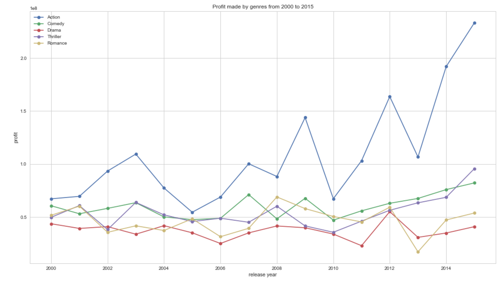
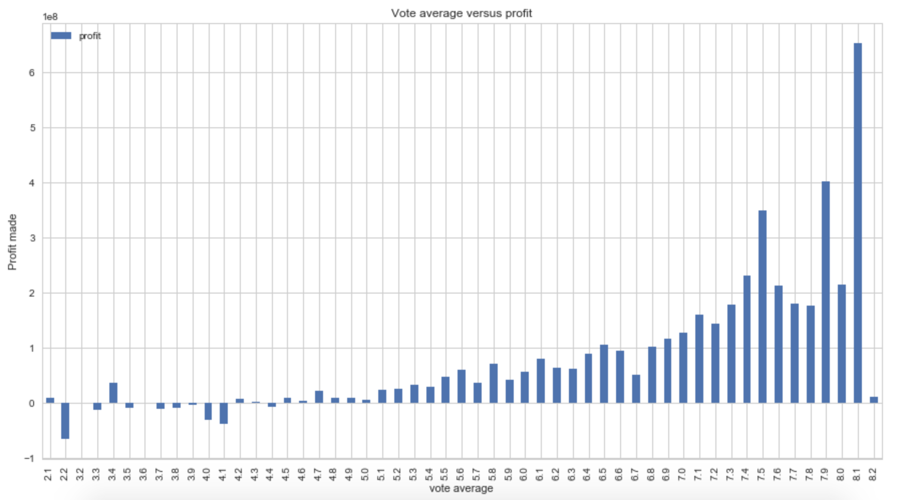

# InvestigateADataset
This project analyses the IMDB dataset focusing on how different film genres perform. Wrangled, cleaned and explored the data. multiple genre classes for one film it is difficult to predict how it will perform based on genre only However, the observations made can show how a film is likely to perform but is not a certainty.Below are the questions asked and the results obtained from exploratory analysis:

### What are the most common and most profitable film genres released in recent years?
The most common genres are: Drama, comedy, thriller, action and romance.
The most profitable genres are: Fantasy, animation, adventure, family and science fiction.

We can see the top 5 most profitable genres aren't the exact same as the 5 most frequently produced genres. However, all of them other than fantasy do still appear in the top 10 most frequently produced films. The most frequently produced films aren't directly the most profitable but are likely to still do well in terms of profit.

### What is the trend for how popular a genre is for each year?
Action varies quite a lot from year to year yet it is still more profitable than other genres even when at its lowest peak.

Comedy is relatively stable with a few peaks in 2007 and 2009. From then onwards it seems to be on an upwards trajectory in terms of profit made.

Romance, thriller and drama seem to be in constant flux. Although they don't vary to the same extent as action films so the profit that they make is much more predictable than with action films.

### Do the films with a higher vote average have a higher profit?
Below the average score of 5 films tend to either make a loss or only make a negligible profit. From the vote average from 5 up to 8.2 there is a general upwards trend of profit.

